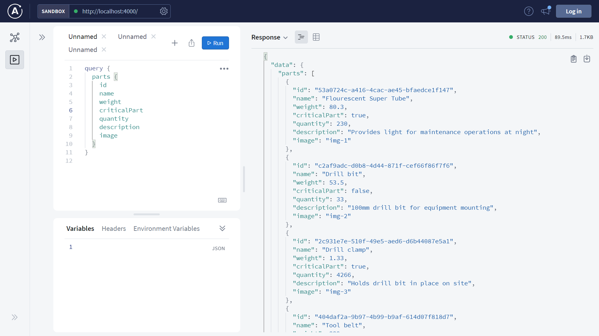
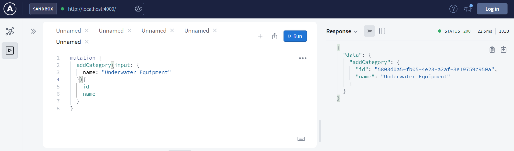

# :zap: Angular GraphQL API

* Node.js + [GraphQL](https://graphql.org/) used with [Apollo Server](https://www.apollographql.com/docs/apollo-server/getting-started/) and GraphQL schema to execute queries on a data set.
* **Note:** to open web links in a new window use: _ctrl+click on link_


## :page_facing_up: Table of contents

* [General info](#general-info)
* [Screenshots](#screenshots)
* [Technologies](#technologies)
* [Setup](#setup)
* [Features](#features)
* [Status](#status)
* [Inspiration](#inspiration)
* [Contact](#contact)

## :books: General info

* GraphQL used to query a mock Engineering parts `db.js` database with field reviews of parts and comments to improve the parts supply process
* An idea of mine to link humdrum parts depots/maintenance to social media-like commenting from field personnel
* Based on my time on engineering sites, where maintenance, spare parts, tools and related warehousing and manhours is big budget. Project costing was based on the weight of the modifications so this was vital data, e.g weight of cables and cable-trays/cable-ladders.
* Engineering parts are classified as critical parts or not with a Boolean `criticalPart` field.
* Users can query, add, mutate (update) and delete parts, categories & field reviews

## :camera: Screenshots




## :signal_strength: Technologies

* [Node.js v14](https://nodejs.org/) Javascript runtime using the [Chrome V8 engine](https://v8.dev/)
* [GraphQL v15](https://graphql.org/)
* [Apollo Server v3](https://www.apollographql.com/docs/apollo-server/getting-started/)
* [uuid v8](https://www.npmjs.com/package/uuid) to create RFC4122 UUIDs

## :floppy_disk: Setup

* `npm i` to install dependencies
* `npm run dev` runs app in the development mode with auto-restart.
* Open [http://localhost:4000](http://localhost:4000) to view it an Apollo GraphQL Server.

## :wrench: Testing

* Tested from GraphQL server Sandbox

## :computer: Code Examples

* list of GraphQL mutations

```javascript
	type Mutation {
		addCategory(input: AddCategoryInput!): Category!
		addPart(input: AddPartInput!): Part!
		addFieldReview(input: AddFieldReviewInput!): FieldReview!
		deleteCategory(id: ID!): Boolean!
		deletePart(id: ID!): Boolean!
		deleteFieldReview(id: ID!): Boolean!
		updateCategory(id: ID!, input: UpdateCategoryInput!): Category
		updatePart(id: ID!, input: UpdatePartInput!): Part
		updateFieldReview(id: ID!, input: UpdateFieldReviewInput!): FieldReview
	}
```

## :cool: Features - Frontend

* GraphQL query only returns the data specified, unlike REST queries that return everything

## :clipboard: Status, Testing & To-Do List

* Status: Working
* To-Do: Test more. Add to readme. Add frontend

## :clap: Inspiration

* [Apollo Docs: Get started with Apollo Server](https://www.apollographql.com/docs/apollo-server/getting-started/)

## :file_folder: License

* N/A

## :envelope: Contact

* Repo created by [ABateman](https://github.com/AndrewJBateman), email: gomezbateman@yahoo.com